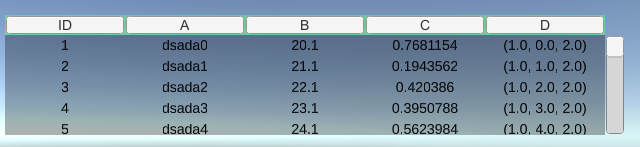
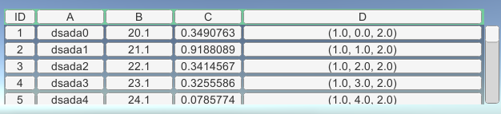
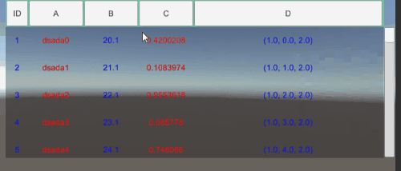

WDataTable
===

WDataTable, a table UI component for Unity3D.

## Feature
* Easy Config
* Sort by Column
* Select Row
* Dynamic Update
# 2.0
* Use [LoopScrollRect](https://github.com/qiankanglai/LoopScrollRect) for performance
* Table Element Pool Support
* Custom Column Style Config
* Handle Table Message
* Support TextMesh Pro
* Per Element Click and Config

## Requirement
* Unity 2018.2+
* No other SDK are required.

## Notice
* If use TextMesh Pro, need Import TMP Essential Resources
* Use can be found in the demo scene

## License
MIT

## Author
[warmtrue](http://www.warmtrue.com)